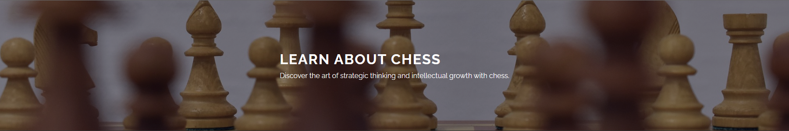

# Learn about chess

## Description
This is a site dedicated to people who are starting to play chess or are simply interested in it. The site is informational in nature. It contains such information as what chess is, basic rules, the most popular chess openings and the best chess players.

## Why I created this site
I created this site because I like playing chess and I want it to be a cool incentive for people who also want to start playing it.

## Technologies
- HTML
- CSS

## Author
Marcel Nędza

  

